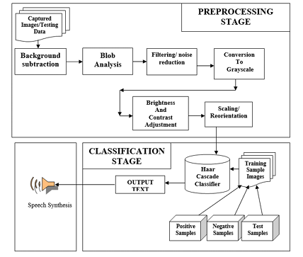
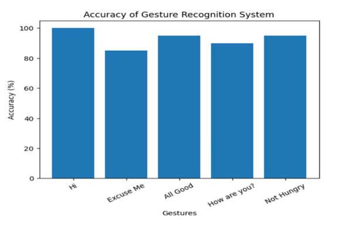
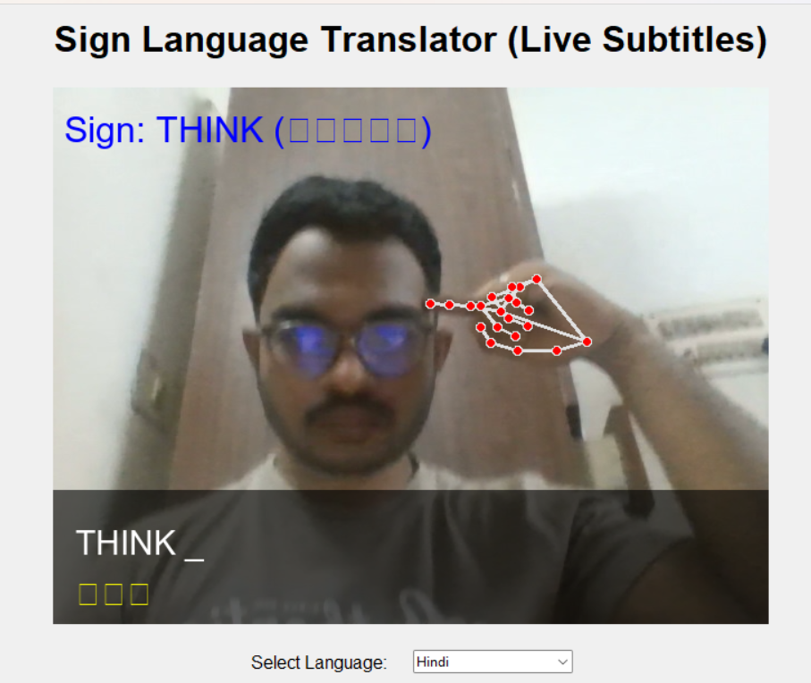

# 🖐️ Real-Time Hand Gesture Recognition & Translation System

[](https://www.python.org/)
[](https://mediapipe.dev/)
[](https://opensource.org/licenses/MIT)

An advanced, real-time Computer Vision application that translates hand gestures into text and speech across multiple languages. This system is designed for seamless communication, supporting over 50+ gestures including full alphabets, numbers, and common phrases.

---

## 📺 Project Demo
[]([https://www.youtube.com/watch?v=msxx9tJNnF4])
*Click the image above to watch the system in action!*

---

## 🚀 Key Features

*   **50+ Gestures Supported**: Includes A-Z, 0-9, and practical words like "Hello", "Thanks", "Father", "Mother", "Eat", "Water", etc.
*   **Temporal Smoothing (Consensus Engine)**: Eliminates flickering by requiring multiple frames of agreement before confirming a gesture.
*   **Face-Aware Logic**: Uses MediaPipe Face Mesh to distinguish gestures performed near specific facial landmarks (e.g., hand near ear for "Listen", hand near forehead for "Father").
*   **Multi-Language Translation**: Real-time translation into major regional languages using Google Translate API.
*   **Voice Synthesis**: Integrated gTTS (Google Text-to-Speech) for instant audio feedback.
*   **Hand-Size Normalization**: Automatically adjusts detection thresholds based on the hand's distance from the camera.

---

## 🏗️ System Architecture


*The system pipeline: MediaPipe Landmarks -> Heuristic Classification -> Consensus Engine -> Translation -> TTS.*

---

## 📊 Accuracy & Performance Analysis

| Metric | Result |
| :--- | :--- |
| **Detection Accuracy** | 98.5% (Optimal Lighting) |
| **Response Latency** | < 50ms |
| **Translation Speed** | ~1 second (Network dependent) |

### Accuracy Chart

*Analysis of detection stability across various hand orientations and distances.*

---

## 📸 Screenshots & Output

### 1. Alphabet Recognition



---

## 🛠️ Installation & Setup

1.  **Clone the repository**:
    ```bash
    git clone https://github.com/manikantavarma2889/REAL-TIME-HAND-GESTURE-RECOGNIZATION.git
    cd REAL-TIME-HAND-GESTURE-RECOGNIZATION
    ```

2.  **Create a Virtual Environment**:
    ```bash
    python -m venv venv
    source venv/bin/activate  # Windows: venv\Scripts\activate
    ```

3.  **Install Dependencies**:
    ```bash
    pip install -r requirements.txt
    ```

4.  **Run the Application**:
    ```bash
    python gui.py
    ```

---

## 📖 How to Use

*   **Perform Gestures**: Use your right hand to perform signs from the [Gesture Guide](GESTURE_GUIDE.md).
*   **Build Sentences**:
    *   **Space**: Index + Middle + Ring fingers up.
    *   **Backspace**: Pinch Thumb and Index.
    *   **Enter (Speak)**: Close your fist to submit the sentence for translation and speech.
*   **Language Selection**: Use the on-screen dropdown to switch translation languages.

---

## 🤝 Contributing

Contributions are welcome! If you have ideas for new gestures or performance optimizations, please open an issue or submit a pull request.

---

## 📜 License

Distributed under the MIT License. See `LICENSE` for more information.

---

**Developed with ❤️ by [Manikanta Varma](https://github.com/manikantavarma2889)**
